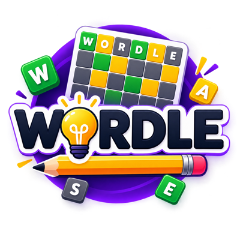
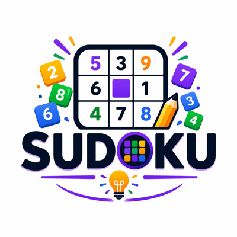
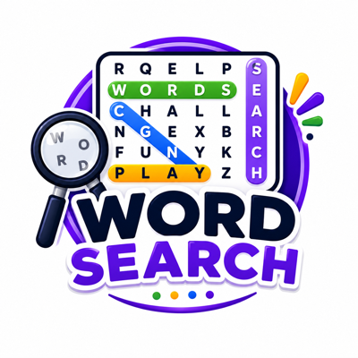
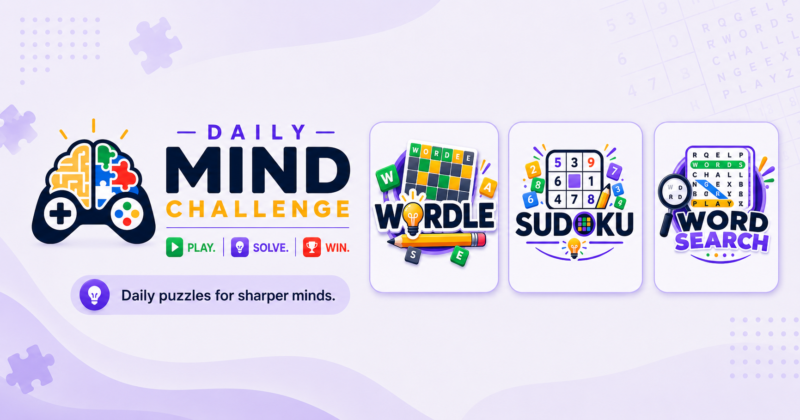
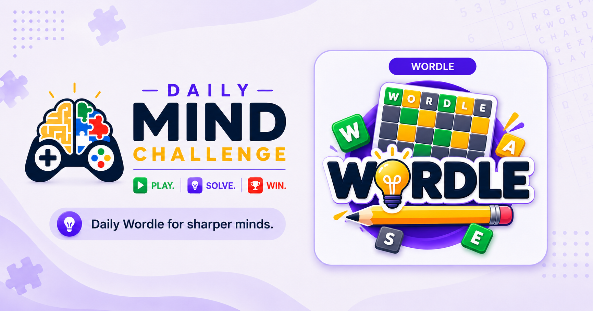
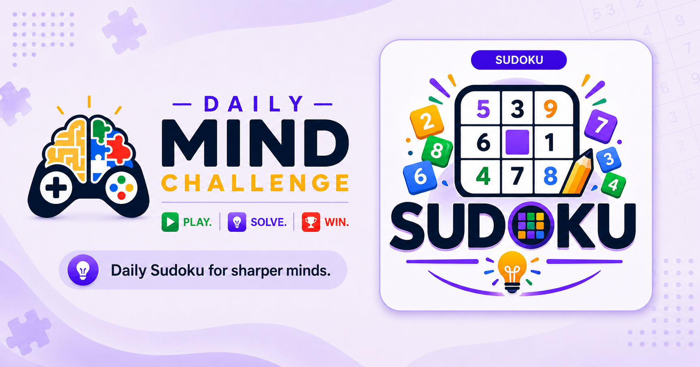
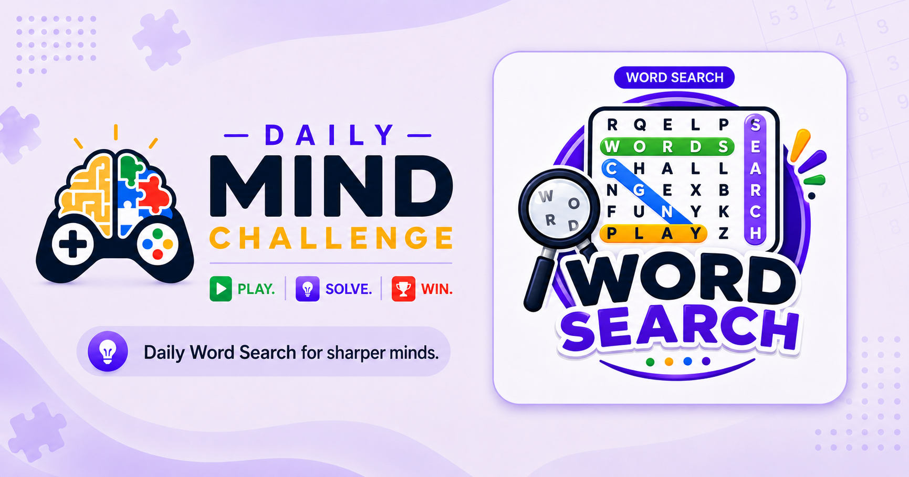

# Facebook / Instagram Campaign Brief — Daily Mind Challenge

A brief written to hand to an external marketing agency for a paid social (Facebook/Instagram)
campaign. Self-contained — every image referenced here lives in `docs/assets/campaign/` alongside
this file, so the whole `docs/` folder (or just this file plus that one subfolder) can be shared
externally with no access to the rest of the codebase needed.

- **Site**: `dailymindchallenge.com`
- **Contact**: `support@dailymindchallenge.com`
- **Platform**: Facebook & Instagram Ads
- **Status**: ready to brief an agency

---

## 1. What it is

Daily Mind Challenge is a free, browser-based puzzle site built around a daily habit: three
well-known puzzle formats — Wordle, Sudoku, and Word Search — each refreshed with a new challenge
once a day. No app download, no install, and no signup wall: anyone can start playing in one tap
as a **guest**. An optional free account adds streak tracking, a daily login bonus, and the
ability to create and share custom challenges.

## 2. The three games, mode by mode

Every game shares the same three-mode shape (**Daily Challenge**, a replay mode, and
**Tournament**), which is itself a useful, repeatable creative hook — "pick your game, then pick
how you want to play it."

### Wordle 🟩

| Mode | What it is |
|---|---|
| **Daily Challenge** | One 5-letter word a day, identical for every player. Guess it in 6 tries; tiles turn green/yellow/gray after each guess, exactly like the original Wordle. |
| **Tournaments** | An admin-curated run of several words back to back, each under a time limit. Fail one word and the whole run resets to word 1 — no partial credit, high stakes, built for players who want a real challenge. Full completion pays out a lump-sum bonus. |
| **Challenge a Friend** | A registered player picks their own 5-letter word, gets a shareable link, and sends it to anyone. The recipient (guest or registered, no account needed) gets one attempt. The creator earns a reward for every distinct person who tries their challenge. This is the built-in viral loop — a real player-to-player share mechanic already live in the product, not something a campaign would need to invent. |

### Sudoku 🔢

| Mode | What it is |
|---|---|
| **Daily Challenge** | One 9×9 puzzle a day, identical for every player. Tap a cell, tap a number (or type it on a keyboard) to fill it in. |
| **Classic** | Pick a difficulty — Easy, Medium, or Hard — and get a random puzzle from that pool. Unlimited replays, any time, no daily limit. |
| **Tournament** | A curated run of puzzles under a per-puzzle time limit and error allowance. Unlike Wordle Tournaments, failing a puzzle here doesn't reset the run — it banks a smaller reward and moves straight to the next puzzle, so a single mistake doesn't cost the whole session. A completion bonus pays out once every puzzle in the run has been attempted. |

### Word Search 🔍

| Mode | What it is |
|---|---|
| **Daily Challenge** | One hidden-word grid a day, identical for every player. Click/tap a letter and drag in a straight line to the matching word's other end. |
| **Classic** | Pick a difficulty (Easy/Medium/Hard, each with its own grid size and word count) and get a random puzzle, with a freshly shuffled grid layout on every replay — no memorizing a fixed layout. |
| **Tournament** | Same forgiving shape as Sudoku's — a run of puzzles under a time limit, a failed puzzle banks a smaller reward and moves on rather than ending the run, plus a live running score shown throughout and a completion bonus at the end. |

## 3. Why this is a good paid-social fit

- **Zero-friction entry.** The ad's landing destination is playable in one tap — no app-store
  detour, no account wall. A much shorter path from click to "aha" than most game/app ads get.
- **Built to be shared already.** Wordle's Challenge a Friend is a real, live player-to-player
  share mechanic — a campaign can lean on and amplify it, not build it from scratch.
- **A daily-habit product.** All three games reset every 24 hours with a streak mechanic — exactly
  the kind of hook that rewards a sustained, always-on campaign over a one-off burst.
- **Proven category.** Daily word/number puzzles are an established, high-engagement habit (see
  Wordle's own rise, and the broader daily-puzzle category). The audience already understands the
  format — the ad's job is introducing this specific site, not the concept.

## 4. Audience

This is squarely the existing daily-word-and-number-puzzle audience — the crowd already playing
Wordle, NYT Games, or a Sudoku app daily. Worth designing creative around:

- **Habitual, not casual.** They already have a puzzle ritual somewhere in their day — commute,
  coffee break, before bed. The pitch is "add this to that ritual," not "discover puzzles."
- **Competitive-with-friends, not competitive-with-strangers.** The leaderboard and Challenge a
  Friend features suggest messaging around besting a specific person, not climbing an anonymous
  global rank.
- **Value variety without switching apps.** A meaningful share of this audience already plays more
  than one puzzle type across separate apps (Wordle *and* a number puzzle *and* a word search) —
  "three in one" is a genuine, differentiated pitch to them.
- **Price- and friction-sensitive.** Free and no-signup-required are real decision factors for
  this audience, not just nice-to-haves — worth stating plainly in copy rather than implying.

> The above is directional, drawn from the product's own design decisions (guest play, streaks,
> challenge-a-friend), not sourced third-party audience research. Worth validating/refining with
> the agency's own Meta Ads Manager audience insights before finalizing targeting.

## 5. Key messages

In rough priority order — lead with whichever tests best, but don't dilute all of these into one ad:

- **"3-in-1"** — one site, three daily puzzles, stop switching between apps.
- **"Free, always"** — completely free, no download, no account required to start.
- **"One tap to play"** — from ad click to playing, no signup wall in the way.

The site's own existing tagline, used consistently in its share copy today: *"Play daily Wordle,
Sudoku, and Word Search puzzles, earn points, and climb the leaderboard."*

## 6. Voice & tone

Warm, encouraging, a little playful — never smug or hardcore-gamer-coded. The product's own copy
leans on this consistently (its help text signs off with *"Enjoy the challenge and have fun!"*).
Emoji are used naturally in the app's own share messages (🧠 🟩 🔥 👀) — a reasonable cue for how
casual ad copy can go, without tipping into gimmicky.

**Avoid**: intensity/competition-only framing ("dominate," "crush"), anything implying a
real-money or gambling mechanic (there is none), and app-store language ("download," "install") —
this is a website, and that friction-free distinction is part of the pitch.

## 7. Brand assets

All images below are included alongside this document (`docs/assets/campaign/`) — nothing here
requires codebase access.

### Logos

| | |
|---|---|
|  | **Main site logo** — the general "Daily Mind Challenge" mark, not tied to any one game. `logo-header.png` |
|  | **Wordle logo** — full-color game tile art, square format. `tile-wordle.png` |
|  | **Sudoku logo** — full-color game tile art, square format. `tile-sudoku.png` |
|  | **Word Search logo** — full-color game tile art, square format. `tile-wordsearch.png` |

### Pre-built share images

Ready-made link-preview images (1731×909), one general and one per game:

| | |
|---|---|
|  | `fb-share-general.png` |
|  | `fb-share-wordle.png` |
|  | `fb-share-sudoku.png` |
|  | `fb-share-word-search.png` |

### Brand palette

| Swatch | Role | Hex |
|---|---|---|
| 🟪 | Primary/brand purple | `#534AB7` (dark variant `#3C3489`) |
| 🟨 | Wordle accent gold | `#D8A030` |
| 🟩 | Sudoku accent green | `#1D9E75` |
| 🟧 | Word Search accent rust | `#D85A30` |

In-app screenshots aren't pre-captured but can be taken directly from the live site on request —
all three games are fully playable at `dailymindchallenge.com`. No video/motion assets exist yet.

The site's existing Facebook Page and Facebook Group are live community channels worth
linking/cross-promoting rather than treating the campaign as the site's only presence.

## 8. Landing destinations

No app-install step — every destination below is the live site itself, playable immediately:

- `dailymindchallenge.com` — home page, all three games
- `dailymindchallenge.com/wordle`
- `dailymindchallenge.com/sudoku`
- `dailymindchallenge.com/wordsearch`

## 9. To be defined together

Everything above is enough for an agency to start scoping creative and targeting direction. These
are genuine open decisions, not omissions — resolve them on the kickoff call:

- **Budget & flight dates** — not yet set.
- **Primary KPI** — candidates: site traffic, daily active players, or Facebook Group/Page growth;
  needs a client decision.
- **Geography** — not yet scoped; English-language markets assumed by default unless specified
  otherwise.
- **Ad format mix** — static, carousel, or video; open to the agency's recommendation given the
  assets listed above.

---

*A polished, shareable web version of this brief was also published as a Claude Artifact in this
session — ask for the link if it wasn't kept.*
